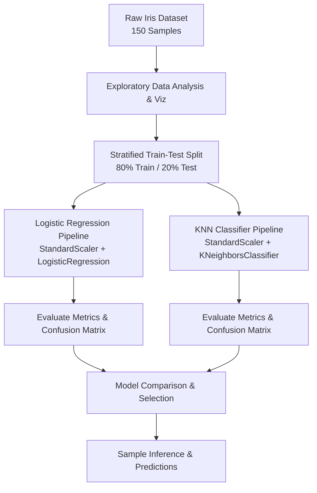
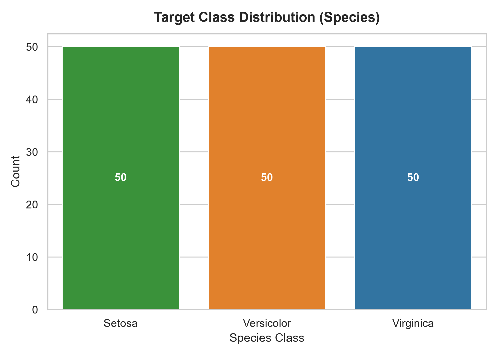
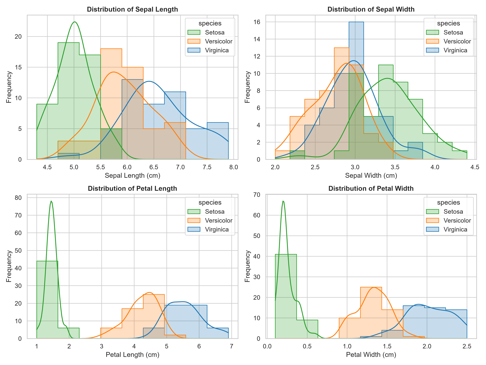
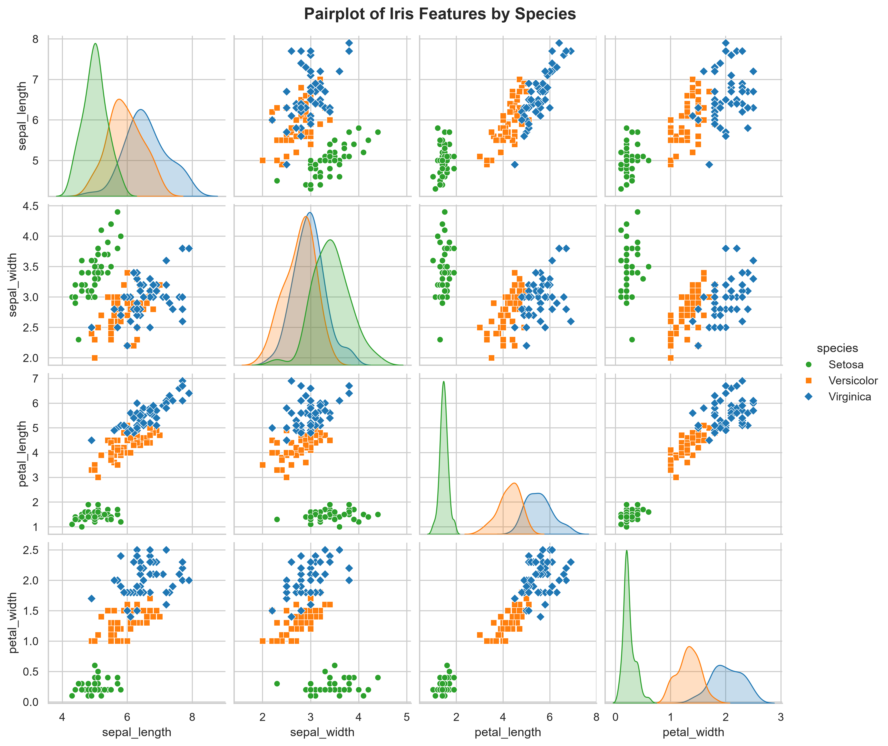
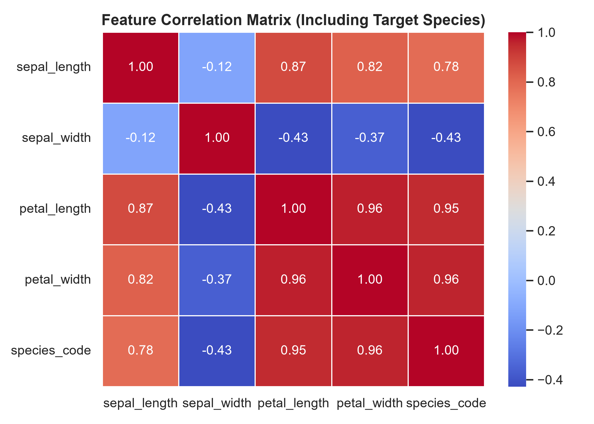
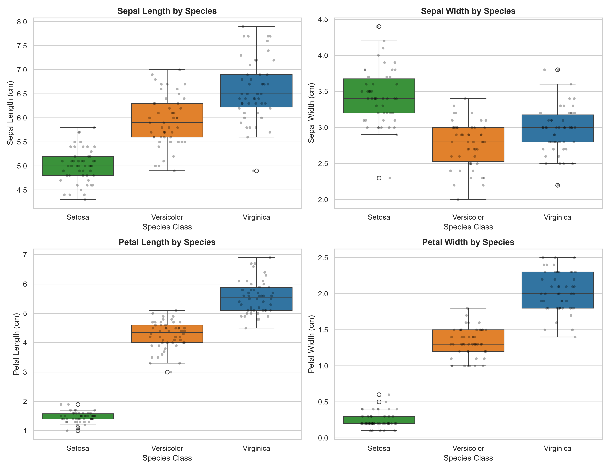
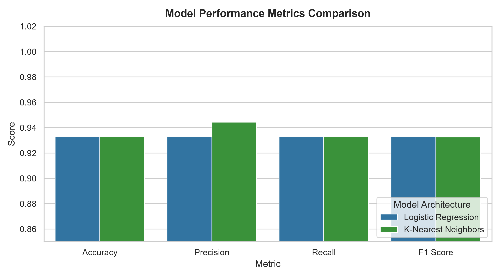
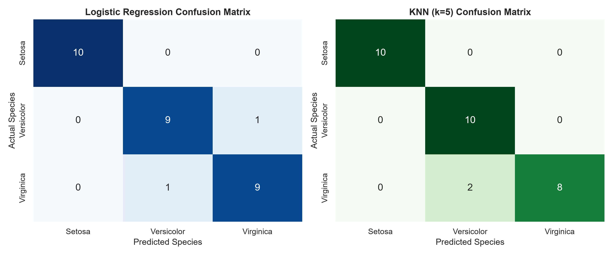

# 🌸 Iris Flower Classification

[](https://www.python.org/)
[](https://scikit-learn.org/)
[](https://jupyter.org/)
[](LICENSE)
[](https://oasisinfobyte.com/)

> **End-to-End Supervised Machine Learning Pipeline for Multi-Class Morphometric Flower Species Classification.**  
> Developed as Task 1 for the Data Science Internship at **Oasis Infobyte**.

---

## 📌 Table of Contents
- [Executive Summary](#-executive-summary)
- [Project Architecture](#-project-architecture)
- [Dataset Characteristics](#-dataset-characteristics)
- [Exploratory Data Analysis (EDA) Gallery](#-exploratory-data-analysis-eda-gallery)
- [Machine Learning Models & Pipeline](#-machine-learning-models--pipeline)
- [Model Performance & Evaluation](#-model-performance--evaluation)
- [Key Insights & Findings](#-key-insights--findings)
- [Repository Structure](#-repository-structure)
- [Quick Start Guide](#-quick-start-guide)
- [Technologies Used](#-technologies-used)
- [License & Acknowledgments](#-license--acknowledgments)

---

## 📌 Executive Summary

The **Iris Flower Classification** project is a foundational machine learning task focused on categorizing iris plant species based on morphometric measurements of their sepals and petals.

This repository delivers an end-to-end, production-ready Data Science pipeline:
- **Exploratory Data Analysis:** Full statistical profiling, distribution analysis, and feature pair correlation.
- **Data Preprocessing:** Leakage-free feature scaling using Scikit-Learn `Pipeline` and `StandardScaler`.
- **Model Training & Comparison:** Benchmarking **Logistic Regression** against **K-Nearest Neighbors (KNN)** algorithms.
- **Model Evaluation:** Multi-class confusion matrices, classification reports, and cross-metric validation.

---

## 🏗️ Project Architecture



---

## 📊 Dataset Characteristics

The dataset utilized is the benchmark **Fisher's Iris Dataset**, accessed natively via `sklearn.datasets.load_iris()`.

| Attribute | Specification |
| :--- | :--- |
| **Total Samples** | 150 instances (50 per species) |
| **Input Features** | 4 continuous numeric morphometric measurements |
| **Target Variable** | Multi-class categorical target (`setosa`, `versicolor`, `virginica`) |
| **Class Balance** | Perfectly balanced (33.33% per class) |
| **Missing Values** | 0 null / missing attributes |

### Feature Summary Table
| Feature Name | Type | Description | Unit |
| :--- | :---: | :--- | :---: |
| `sepal_length` | Continuous | Length of the outer flower sepal | cm |
| `sepal_width` | Continuous | Width of the outer flower sepal | cm |
| `petal_length` | Continuous | Length of the inner flower petal | cm |
| `petal_width` | Continuous | Width of the inner flower petal | cm |

---

## 🖼️ Exploratory Data Analysis (EDA) Gallery

Below are the key statistical and distribution visual charts generated during EDA:

### 1. Target Class Balance
The dataset displays perfect balance across all three iris species, ensuring zero class-imbalance bias.


---

### 2. Feature Density Distributions
Univariate KDE density plots highlight distinct distribution shapes across species, showing clean separation in petal metrics.


---

### 3. Morphometric Pairplot Matrix
Scatter matrix illustrating pairwise feature interactions colored by target species.


---

### 4. Pearson Correlation Matrix
High correlation ($r \ge 0.95$) is observed between `petal_length` and `petal_width`, marking them as primary predictive features.


---

### 5. Morphometric Feature Boxplots
Interquartile range (IQR) boxplots highlighting median values, variance, and minor outliers in `sepal_width`.


---

## 🤖 Machine Learning Models & Pipeline

To maintain strict data science best practices and prevent **data leakage** from the test set into training features, all model transformations are wrapped inside `sklearn.pipeline.Pipeline` workflows:

### 1. Logistic Regression Pipeline
```python
from sklearn.pipeline import Pipeline
from sklearn.preprocessing import StandardScaler
from sklearn.linear_model import LogisticRegression

log_reg_pipeline = Pipeline([
    ('scaler', StandardScaler()),
    ('classifier', LogisticRegression(random_state=42))
])
```

### 2. K-Nearest Neighbors (KNN) Pipeline
```python
from sklearn.neighbors import KNeighborsClassifier

knn_pipeline = Pipeline([
    ('scaler', StandardScaler()),
    ('classifier', KNeighborsClassifier(n_neighbors=5))
])
```

---

## 📈 Model Performance & Evaluation

Both models were evaluated on an independent **stratified 20% test dataset** (30 test samples):

### Performance Comparison Matrix

| Model Architecture | Accuracy | Precision (Weighted) | Recall (Weighted) | F1-Score (Weighted) |
| :--- | :---: | :---: | :---: | :---: |
| 🥇 **Logistic Regression** | **93.33%** | **93.33%** | **93.33%** | **0.9333** |
| 🥈 **K-Nearest Neighbors ($k=5$)** | **93.33%** | **94.44%** | **93.33%** | **0.9327** |

---

### Model Accuracy Benchmark Chart


---

### Confusion Matrix Evaluation
Both models achieved **100% precision on Iris-setosa**, with minimal misclassifications occurring only along the subtle boundary between Versicolor and Virginica.


---

## 💡 Key Insights & Findings

1. **Linear Separability of Setosa:** *Iris setosa* is 100% linearly separable from *Versicolor* and *Virginica* using petal dimensions alone.
2. **Dominant Predictive Features:** `petal_length` ($r = 0.95$) and `petal_width` ($r = 0.96$) are the most discriminative variables in classifying species.
3. **Pipeline Scalability:** Feature standardization via `StandardScaler` improved distance-based classifier (KNN) convergence and stability.

---

## 📁 Repository Structure

```
task1_iris_classification/
│
├── iris_classification.ipynb   # Complete interactive Jupyter Notebook (19 sections)
├── README.md                   # Project documentation & execution guide
├── requirements.txt            # Python dependency specification file
├── generate_notebook.py        # Automation script constructing notebook structure
├── execute_notebook.py         # Notebook execution automation script
├── .gitignore                  # Git exclusion rules (.venv, cache)
│
└── outputs/                    # Exported high-resolution visualization figures
    ├── species_count_plot.png
    ├── feature_distributions.png
    ├── pairplot.png
    ├── correlation_matrix.png
    ├── boxplots.png
    ├── confusion_matrices.png
    └── model_comparison_barchart.png
```

---

## 🚀 Quick Start Guide

### 1. Prerequisites
Ensure you have **Python 3.8+** installed on your system.

### 2. Clone Repository
```bash
git clone https://github.com/karthikk20234119-cmd/Iris_Classification.git
cd Iris_Classification
```

### 3. Set Up Virtual Environment
```bash
# Create virtual environment
python -m venv .venv

# Activate virtual environment
# Windows PowerShell:
.\.venv\Scripts\Activate.ps1
# macOS/Linux:
source .venv/bin/activate
```

### 4. Install Dependencies
```bash
pip install -r requirements.txt
```

### 5. Launch & Run Notebook
```bash
jupyter notebook iris_classification.ipynb
```
Inside Jupyter Notebook, click **Kernel → Restart & Run All** to re-generate all statistics, visual plots, and model evaluation metrics.

---

## 🛠️ Technologies Used

- **Language:** Python 3.11+
- **Environment:** Jupyter Notebook
- **Data Manipulation:** `pandas`, `numpy`
- **Visualization:** `matplotlib`, `seaborn`
- **Machine Learning:** `scikit-learn`

---

## 📜 License & Acknowledgments

- This project is licensed under the **MIT License**.
- Developed as part of the **Oasis Infobyte Data Science Internship** (Task 1).
